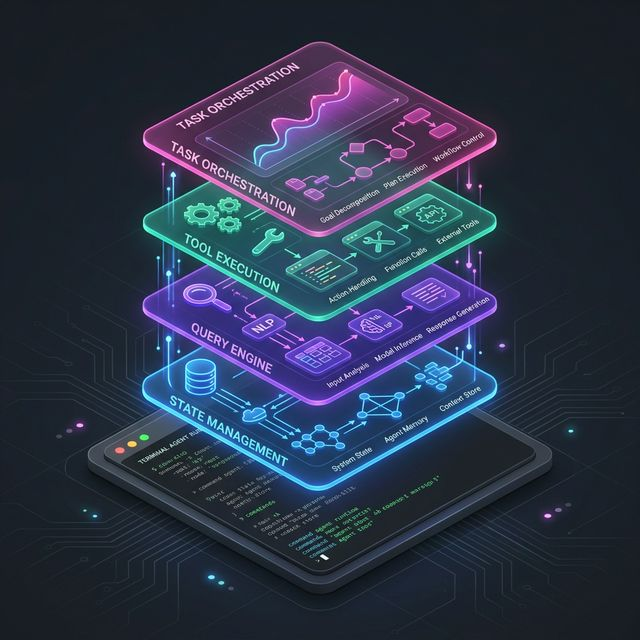
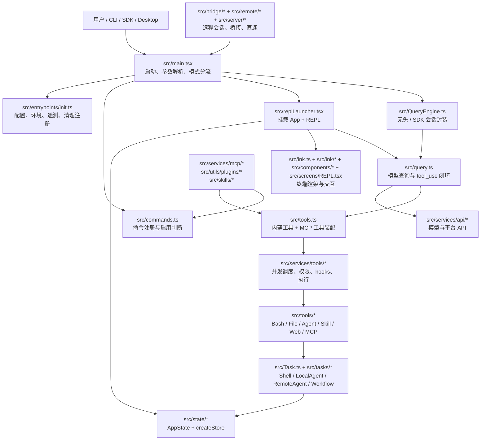
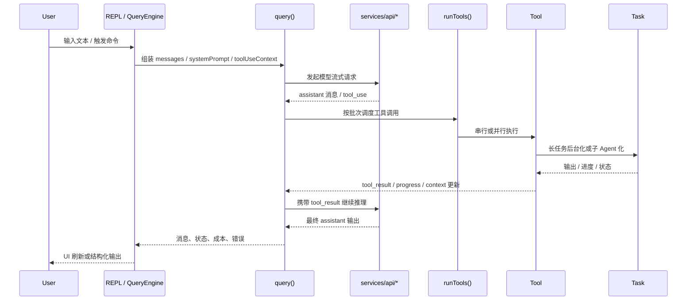

# 架构分析

项目不是一个“简单封装 Claude API 的 CLI”，而是一套完整的终端 Agent 运行时。它至少包含 6 层能力：

- 启动与模式分流
- 终端 UI 与状态管理
- 命令系统
- 模型查询与工具执行闭环
- Task / Agent 异步任务系统
- 插件、技能、MCP、远程桥接扩展层

从源码组织上看，它的核心不是某一个单点文件，而是围绕 `query -> tool -> task -> state -> ui` 这一条主链路展开。

## 仓库体量与重心

当前 `src/` 一共约 `1902` 个文件，重心非常明显：

- `src/utils/`：`564` 个文件，承担权限、文件系统、git、sandbox、telemetry、插件、prompt 等横切能力
- `src/components/`：`389` 个文件，终端 UI 组件很多，说明交互层很重
- `src/commands/`：`207` 个文件，命令系统非常丰富
- `src/tools/`：`184` 个文件，模型可调用工具是核心能力面
- `src/services/`：`130` 个文件，承接 API、MCP、LSP、compact、analytics、tool orchestration 等服务

这意味着它更像一个“终端中的应用平台”，而不是一组零散脚本。

## 总体架构图

## 一次请求的主执行流

这条链路在源码中的关键落点是：

- `src/screens/REPL.tsx`：交互式入口直接驱动 `query()`
- `src/QueryEngine.ts`：无头模式对会话生命周期做封装，再调用 `query()`
- `src/query.ts`：维护消息流、compact、tool_use 循环
- `src/services/tools/toolOrchestration.ts`：决定工具串行还是并发
- `src/services/tools/toolExecution.ts`：真正执行单个工具，并处理权限、hooks、进度、结果

## 模块拆分

| 层级 | 主要目录 / 文件 | 作用 | 说明 |
| --- | --- | --- | --- |
| 启动装配层 | `src/main.tsx`、`src/entrypoints/init.ts`、`src/bootstrap/*` | 程序启动、配置加载、环境变量处理、模式分流 | 是所有运行形态的总入口 |
| 状态中心 | `src/state/*`、`src/context/*`、`src/history.ts` | 全局状态、订阅、通知、会话信息 | 使用自定义 store，而不是 Redux 一类框架 |
| 终端 UI 层 | `src/ink.ts`、`src/ink/*`、`src/components/*`、`src/screens/REPL.tsx` | Ink 渲染、输入处理、终端交互 | UI 复杂度很高，说明 REPL 是一等公民 |
| 命令层 | `src/commands.ts`、`src/commands/*`、`src/types/command.ts` | `/command`、本地命令、Local JSX 命令 | 命令分 `prompt`、`local`、`local-jsx` 三类 |
| 查询内核 | `src/query.ts`、`src/QueryEngine.ts` | 管理消息、系统提示词、模型请求、tool loop | REPL 与 SDK 共用这一层核心逻辑 |
| 工具定义层 | `src/Tool.ts`、`src/tools.ts`、`src/tools/*` | 工具 schema、权限、并发安全、具体实现 | `assembleToolPool()` 是工具装配中枢 |
| 工具执行层 | `src/services/tools/*` | 工具调度、hooks、权限决策、结果落盘、并发控制 | 真正把模型输出的 `tool_use` 执行起来 |
| 任务 / Agent 层 | `src/Task.ts`、`src/tasks.ts`、`src/tasks/*` | shell、子 agent、远程 agent、workflow 生命周期管理 | 把长耗时动作抽成可跟踪任务 |
| CLI 适配层 | `src/cli/*` | 非交互输出、结构化 IO、传输适配 | 面向 SDK、SSE、WebSocket 等宿主 |
| 扩展层 | `src/services/mcp/*`、`src/utils/plugins/*`、`src/skills/*` | MCP 连接、插件发现与加载、技能注入 | 外部能力的主要接入口 |
| 远程 / 桥接层 | `src/bridge/*`、`src/remote/*`、`src/server/*` | 远程会话、bridge worker、直连会话 | 说明它不只服务本地单机 REPL |
| 横切基础设施 | `src/utils/*`、`src/services/*` | git、文件、telemetry、sandbox、permissions、LSP 等 | 这是仓库最大的公共能力层 |

## 核心抽象

### 1. Command

命令是“用户入口”级别的能力，定义在 `src/types/command.ts`，主要分三类：

- `prompt`：把命令转成 prompt 内容，交给模型继续执行
- `local`：本地逻辑命令
- `local-jsx`：会渲染终端 UI 的本地命令

这说明命令系统负责“进入哪条流程”，而不是直接承担底层执行。

### 2. Tool

工具是“模型在推理过程中可调用的原子能力”，核心定义在 `src/Tool.ts` 和 `src/tools.ts`。  
典型工具包括：

- `BashTool`
- `FileReadTool`
- `FileEditTool`
- `AgentTool`
- `SkillTool`
- `WebSearchTool`
- `MCP` 相关工具

Command 和 Tool 是这套架构里最重要的一次分层：

- Command 负责入口与意图转换
- Tool 负责模型可调用的底层动作

### 3. Task

Task 是长时操作的统一载体，定义在 `src/Task.ts`。已经能看到的任务类型包括：

- `local_bash`
- `local_agent`
- `remote_agent`
- `in_process_teammate`
- `local_workflow`
- `monitor_mcp`
- `dream`

这意味着项目天然支持“前台对话 + 后台执行 + 结果回流”。

### 4. AppState

`src/state/AppStateStore.ts` 把消息、任务、MCP、插件、通知、权限、agent 定义等状态都收进一个中心 store。  
`src/state/store.ts` 则是一个非常轻量的自定义 store 实现。

这层设计让它可以同时服务：

- 终端 UI 渲染
- 工具执行上下文
- 任务状态刷新
- 插件 / MCP 接入后的动态状态变化

### 5. Skill

`src/tools/SkillTool/SkillTool.ts` 表明 Skill 不是单纯的文档目录，而是一类可执行能力：

- 可以作为命令被加载
- 可以以内联 prompt 的方式运行
- 也可以 fork 成子 agent 执行
- 还能与插件和 MCP 技能一起进入命令空间

所以 Skill 更接近“高阶能力模板”，而不是纯静态说明文件。

## 运行模式拆分

### 1. 交互式 REPL

主链路大致是：

`src/main.tsx` -> `src/replLauncher.tsx` -> `src/components/App.tsx` + `src/screens/REPL.tsx` -> `src/query.ts`

这是最完整的终端交互路径，也是 UI 代码最重的一条链。

### 2. 无头 / SDK 模式

主链路大致是：

`src/QueryEngine.ts` -> `submitMessage()` -> `src/query.ts`

这一层把会话状态、文件缓存、权限拒绝、usage 统计等封装好，提供给 SDK 或非交互调用方使用。

### 3. 远程 / Bridge 模式

从源码看，至少有三块能力：

- `src/bridge/bridgeMain.ts`：bridge 轮询、session spawn、worktree、heartbeat
- `src/remote/RemoteSessionManager.ts`：远程 session 的 WebSocket / control flow 管理
- `src/server/createDirectConnectSession.ts`：直连服务器的 session 创建

这说明项目不是“只能在本机跑的 CLI”，而是有远程执行和会话桥接能力。

## 这套架构最值得注意的几个点

- **Command 和 Tool 明确分层**：这是理解整个项目最关键的切口。
- **REPL 和 SDK 共用执行内核**：交互式和无头模式在 UI 上分叉，在查询与工具层汇合。
- **Tool 执行是独立服务层**：不是在 `query.ts` 里硬编码直接调用，而是通过 `src/services/tools/*` 调度。
- **异步 Task 是一等公民**：说明项目面向复杂、多步骤、可中断、可恢复的工程任务。
- **扩展体系不止一种**：插件、技能、MCP、远程桥接分别解决不同维度的扩展问题。
- **Feature Flag 很重**：大量代码通过 `bun:bundle` 和环境变量裁剪，不同构建形态实际能力面会不同。
- **仓库混合了源码与编译痕迹**：部分文件可见 `react/compiler-runtime` 和内联 `sourceMappingURL`，阅读时优先抓主干文件，不要平均用力。

## 建议的阅读顺序

如果要尽快接手这个项目，建议按下面的顺序读：

1. `src/main.tsx`
2. `src/entrypoints/init.ts`
3. `src/state/AppStateStore.ts` 和 `src/state/store.ts`
4. `src/screens/REPL.tsx`
5. `src/query.ts`
6. `src/services/tools/toolOrchestration.ts` 和 `src/services/tools/toolExecution.ts`
7. `src/tools.ts`
8. `src/tools/BashTool/BashTool.tsx`、`src/tools/AgentTool/AgentTool.tsx`、`src/tools/SkillTool/SkillTool.ts`
9. `src/Task.ts` 和 `src/tasks/*`
10. `src/services/mcp/*`、`src/utils/plugins/*`、`src/skills/*`

## 总结

如果只用一句话概括，这个仓库的本质是：

**一个以终端为界面、以 Query/Tool/Task 为执行内核、以插件/MCP/Skill 为扩展机制的工程化 Agent 平台。**

它最核心的源码主线不是“某个具体命令”，而是：

**`main -> repl/query-engine -> query -> tools -> tasks -> state -> ui`**
