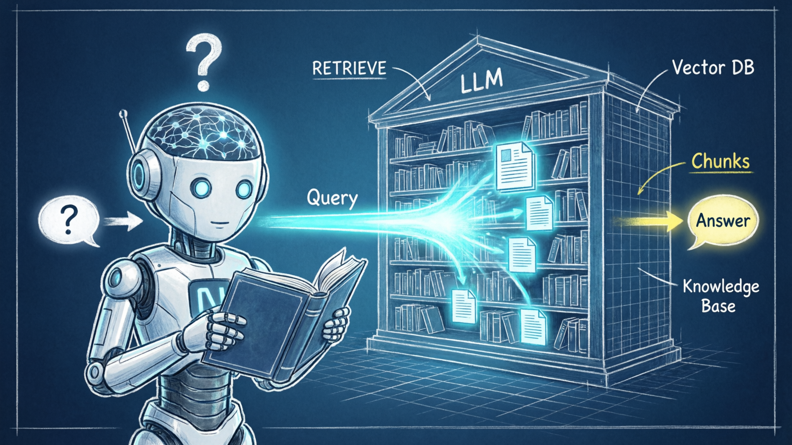
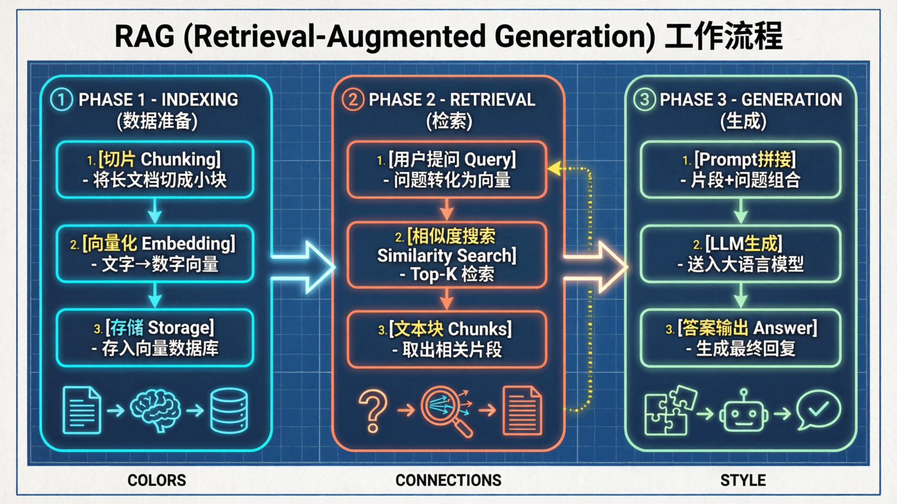
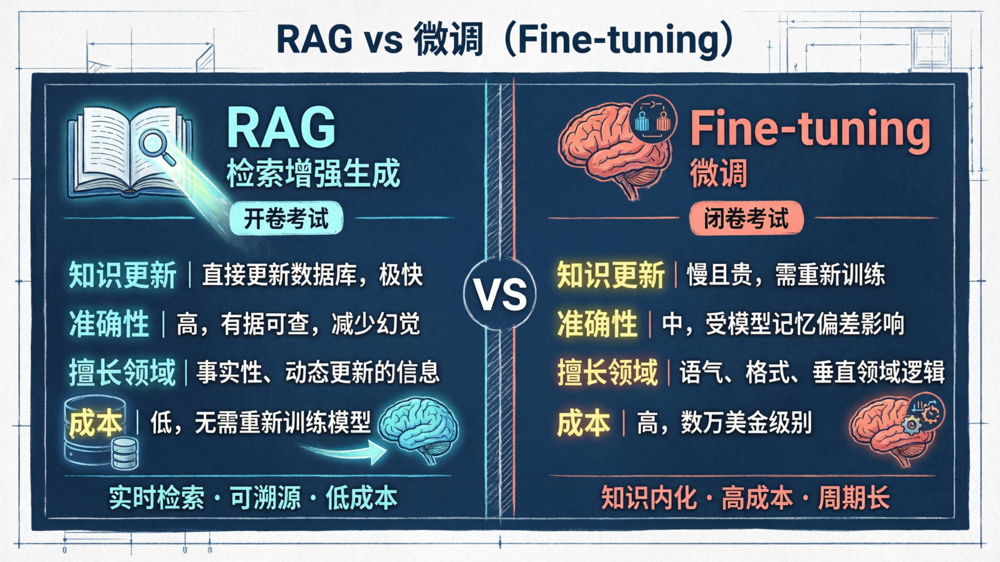
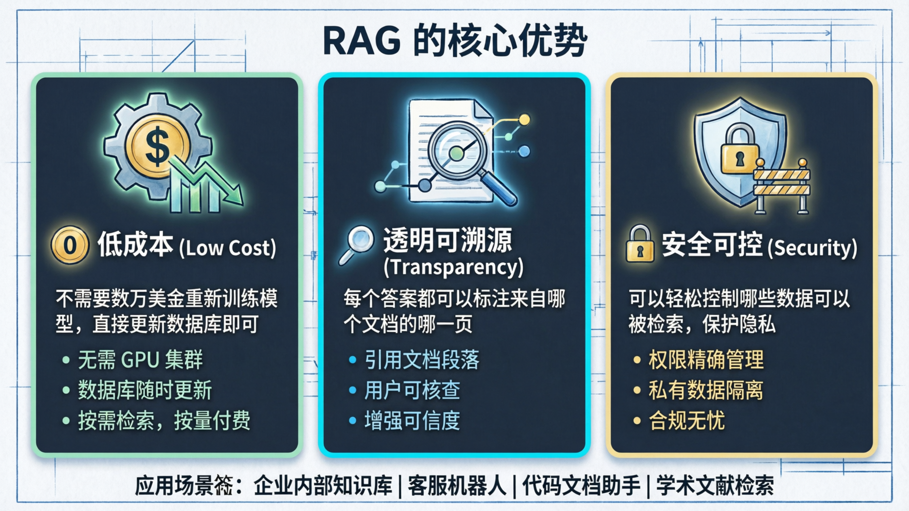

# RAG（检索增强生成）

RAG（检索增强生成）是一种让大语言模型在回答问题时，能够先从外部知识库中**检索相关信息**，再基于这些信息生成答案的技术架构。

简单来说，**RAG (Retrieval-Augmented Generation，检索增强生成)** 是一种让大语言模型（LLM）通过“翻书”来回答问题的技术。

如果把大模型比作一个非常有才华但记忆力有限的”学霸”，RAG 就是给这位学霸配了一个**实时更新的图书馆**。当学霸遇到不确定的问题时，他会先去图书馆查阅相关资料，再结合自己的知识给出一个准确的答案。

### 1. 为什么需要 RAG？
* **幻觉问题**：模型会一本正经地胡说八道。
* **时效性滞后**：模型的知识停留在训练数据截止日期（比如 2024 年或更早），不知道昨天发生的新闻。
* **缺乏私域知识**：模型没读过你公司的内部文档、私人笔记或特定行业的手册。
- **可溯源**：答案可以标注来源文档，方便核查，增强可信度。

### 2. RAG 的工作流程
RAG 的核心流程可以拆分为三个主要阶段：

#### 第一阶段：数据准备（Indexing）
* **切片**：将长文档切成一小块一小块（Chunks）。
* **向量化**：将这些文字转化为机器能理解的数字向量（Embeddings）。
* **存储**：把这些向量存进“向量数据库”里。

#### 第二阶段：检索（Retrieval）
* 当用户提问时，系统会把问题也转化为向量，然后在数据库里寻找**内容最相关**（Top-K ）的几个片段。

#### 第三阶段：生成（Generation）
* 将这些文本块与原始问题拼接成完整的 Prompt，最后送入 LLM 生成答案

### 3. RAG vs. 微调（Fine-tuning）
这是很多人容易混淆的点。我们可以用一个形象的比喻：

| 特性 | RAG（检索增强） | Fine-tuning（微调） |
| :--- | :--- | :--- |
| **类比** | **开卷考试**（看资料回答） | **闭卷考试**（把知识背进脑子里） |
| **知识更新** | 极快（直接更新数据库即可） | 慢且贵（需要重新训练） |
| **准确性** | 高（有据可查，减少幻觉） | 中（容易受模型记忆偏差影响） |
| **擅长领域** | 处理事实性、动态更新的信息 | 学习特定的语气、格式或垂直领域逻辑 |

### 4. RAG 的优势

* **低成本**：不需要动辄花费数万美金去训练模型。
* **透明度**：可以提供“引文”，告诉你答案是从哪个文档的哪一页来的。
* **安全性**：你可以轻松控制哪些数据可以被检索，保护隐私。

### 5. 进阶趋势
现在的 RAG 已经进化到了 **Advanced RAG** 阶段，引入了：

* **查询改写**：如果用户问得模糊，系统先帮用户优化问题。
* **重排序 (Rerank)**：搜出一堆资料后，用另一个模型精挑细选最精准的。
* **混合搜索**：结合关键词搜索和语义搜索，确保万无一失。

**常见应用场景**：企业内部知识库问答、客服机器人、代码文档助手、学术文献检索等。

